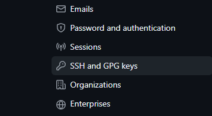

# 本地部署 hexo 博客到云端

环境：Windows 10

## 1. 安装 Git

[Git](https://git-scm.com/)

## 2. 安装 Node.js

[Node.js](https://nodejs.org/)

## 3. 安装 Hexo

[Hexo](https://hexo.io/)

## 4. 安装数学渲染器 Pandoc

[Pandoc 官网](https://pandoc.org/)

[Pandoc Github 地址](https://github.com/jgm/pandoc/releases)

## 自动部署脚本

```cmd
cmd /k "<你的blog所在盘符>: cd <你的blog根目录> && npx hexo clean && npx hexo d"
```

另存为 *bat* 文件.

## 如果重装系统

如果重装系统，在完成上述步骤后，需要重新获取对仓库的访问权限.

此处以 Github 仓库为例:

```cmd
ssh-keygen -t ed25519 -b 4096 -C "your_email@example.com"
```

-t rsa 指定了加密算法类型（type）为 *Ed25519* 算法,

不支持该算法的计算机可以用 *rsa* 算法

摘自 Github Docs

> If you are using a legacy system that doesn't support the Ed25519 algorithm, use:
>
> ```shell
> ssh-keygen -t rsa -b 4096 -C "your_email@example.com"
> ```

-b 4096 指定了 key 的大小（bits）为 4096（默认为 2048）

使用该命令在默认路径 （AppData 的 .ssh） 下生成公钥和私钥,

然后 **将公钥添加至 Github**:

在 Github 的 Settings -> SH and GPG keys 中添加一个新的 SSH key.



最后重新运行刚刚的 bat 文件进行部署.

## 图片路径问题

图片粘贴到 MarkDown 文件后，在本地正常预览，但部署后无法正常预览（生成的 html 路径有误），

使用 *[hexo-assets-img](https://github.com/yiyungent/hexo-asset-img)* 解决, （需要删除其他修复 hexo 图片路径的插件）

具体见 README.

## 参考 Reference

> [Stack Overflow](https://stackoverflow.com/questions/51834225/why-use-t-rsa-b-4096-with-ssh-keygen)
>
> [GitHub Docs](https://docs.github.com/en/authentication/connecting-to-github-with-ssh/generating-a-new-ssh-key-and-adding-it-to-the-ssh-agent)

