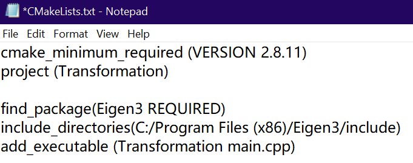
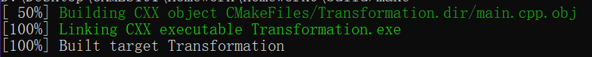

# CMake 成功编译但 Make 出现 No such file or directory
## 问题

*CMakeLists.txt* 的 *include_directories()* 中路径没 **用双引号引起来**



## 解决方案

改为:

```makefile
include_directories("C:/Program Files (x86)/Eigen3/include")
```



